# Service Flow

**Service Flow** is a comprehensive Field Service Management (FSM) application built with Flutter. It is designed to streamline business operations for service providers, allowing them to manage everything from service requests and job scheduling to inventory and payments in one unified platform.

## 🚀 Key Features

- **Dashboard:** Real-time overview of business performance and active jobs.
- **Service Requests:** Efficiently capture and track customer service needs.
- **Job Management:** Assign, schedule, and monitor jobs throughout their lifecycle.
- **Technician Tracking:** Manage field staff, their schedules, and assignments.
- **Inventory Management:** Track parts, stock levels, and low-stock alerts.
- **Customer CRM:** Maintain a detailed database of customers and their service history.
- **Financial Tools:** Manage payments, track expenses, and generate detailed reports.
- **Calendar View:** Visual scheduling of jobs and technician availability.

## 📱 App Screenshots

<p align="center">
  
  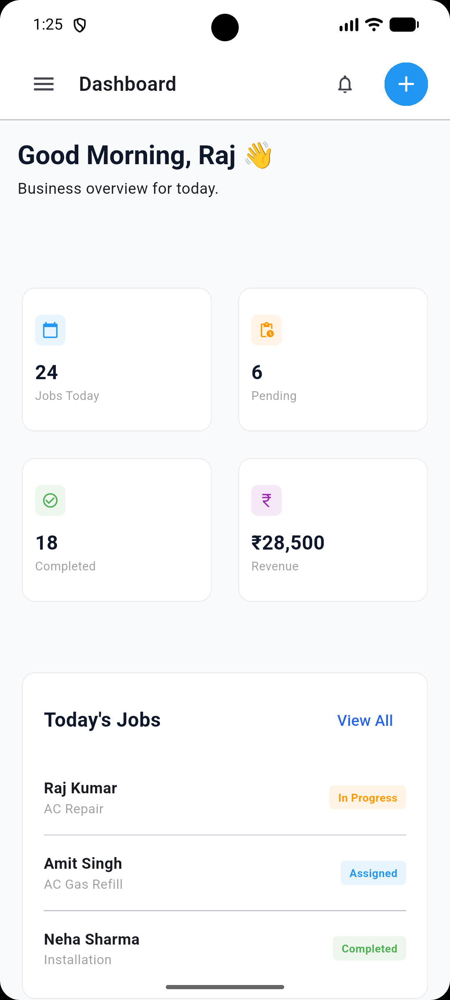
  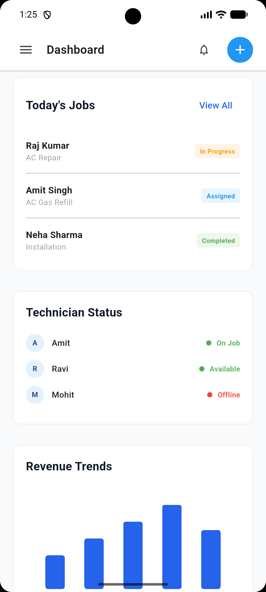
</p>

<p align="center">
  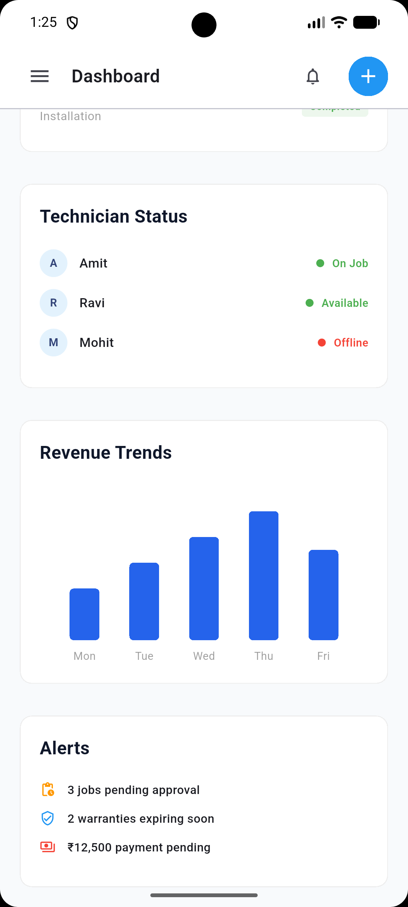
  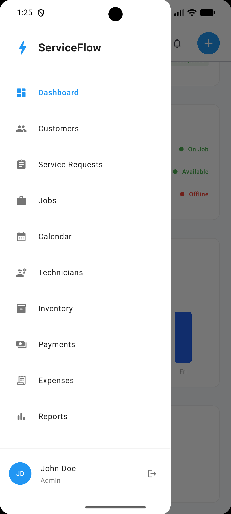
  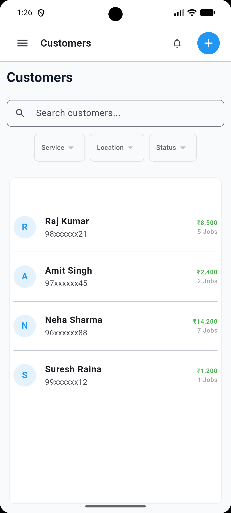
</p>

<p align="center">
  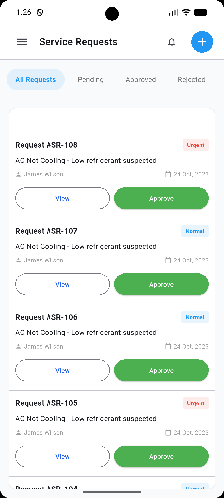
  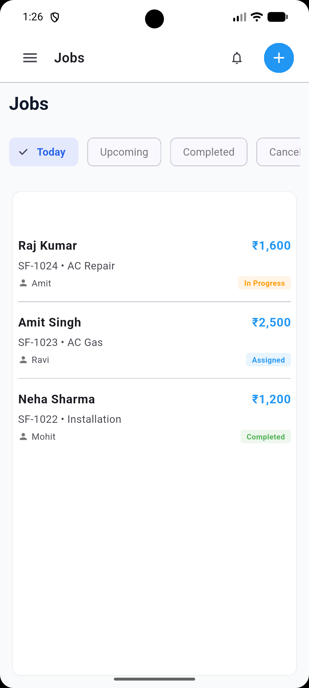
  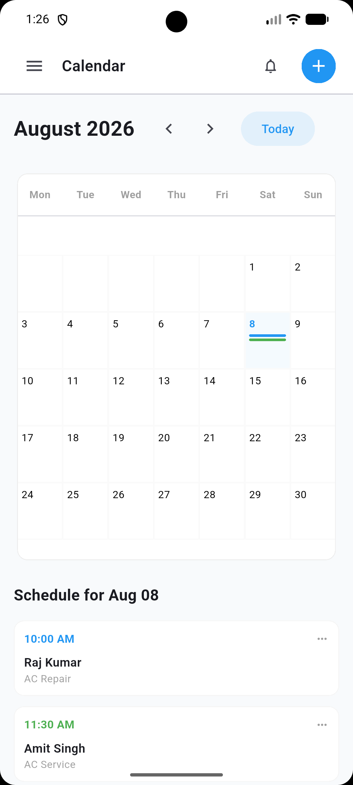
</p>

<p align="center">
  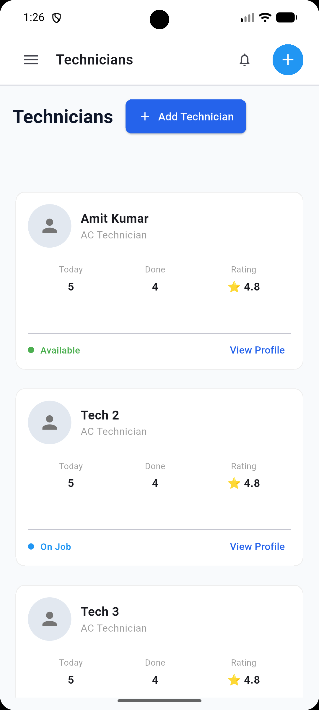
  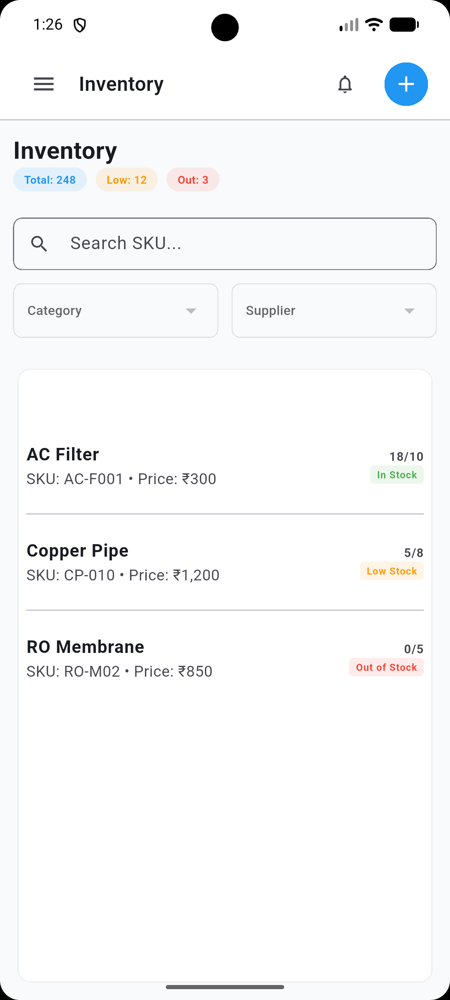
  
</p>

<p align="center">
  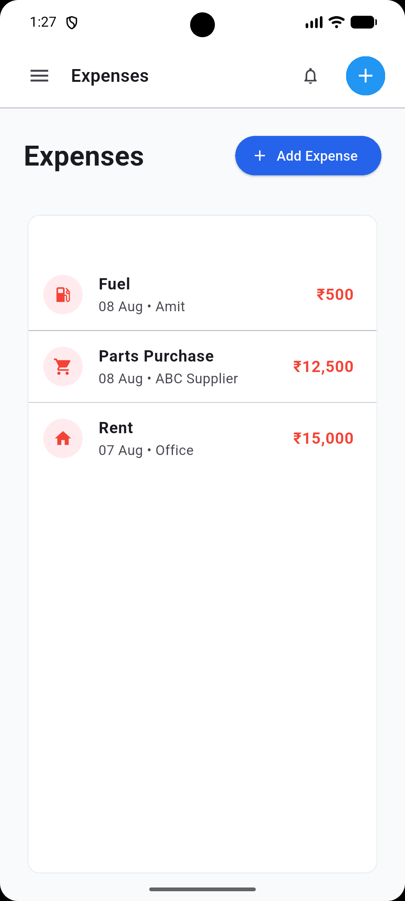
  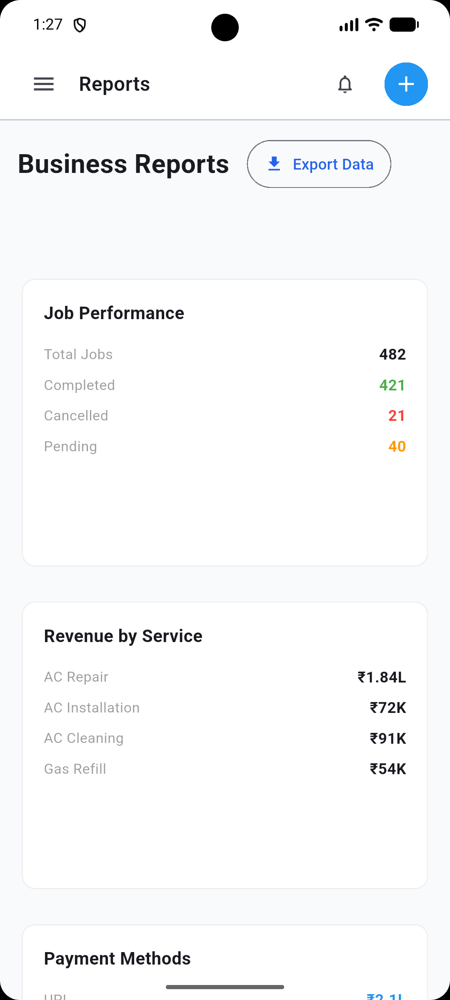
</p>

## 📥 Download APK

You can download the latest version of the app directly from the repository:

👉 **[Download Service Flow APK](Assets/app-arm64-v8a-release.apk)**

## 🛠️ How to Run

To run this project locally, follow these steps:

1.  **Prerequisites:**
    - Install [Flutter SDK](https://docs.flutter.dev/get-started/install).
    - Setup an Android/iOS emulator or connect a physical device.

2.  **Clone the repository:**
    ```bash
    git clone https://github.com/your-username/service_flow.git
    cd service_flow
    ```

3.  **Install dependencies:**
    ```bash
    flutter pub get
    ```

4.  **Run the application:**
    ```bash
    flutter run
    ```

## 🏗️ Built With

- [Flutter](https://flutter.dev/) - UI Toolkit
- [Dart](https://dart.dev/) - Programming Language
- [Material Design 3](https://m3.material.io/) - Design System
